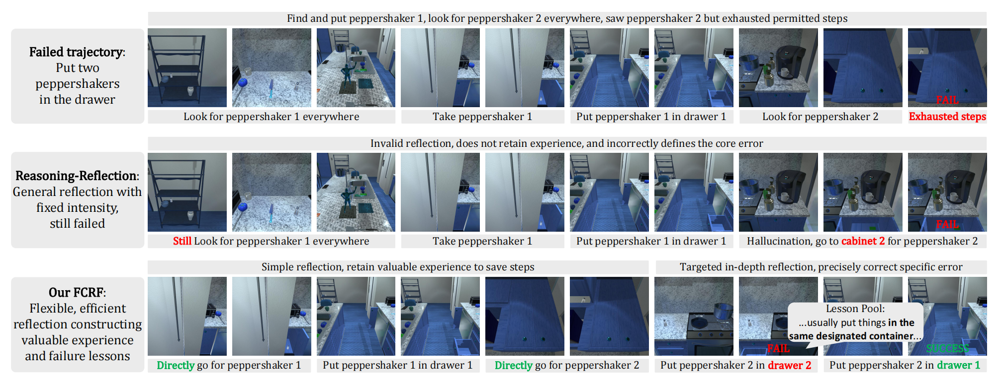
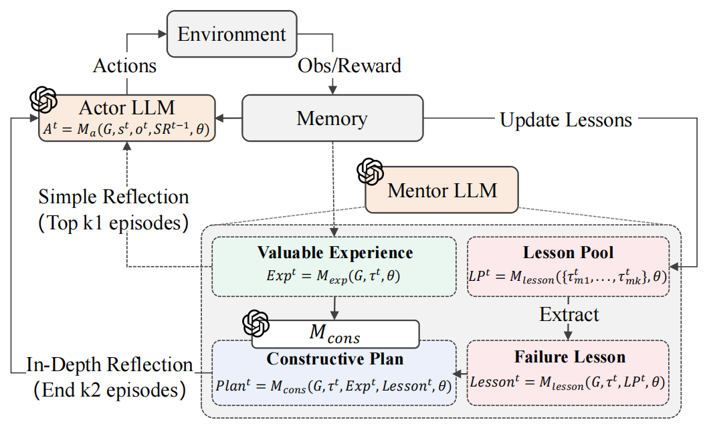
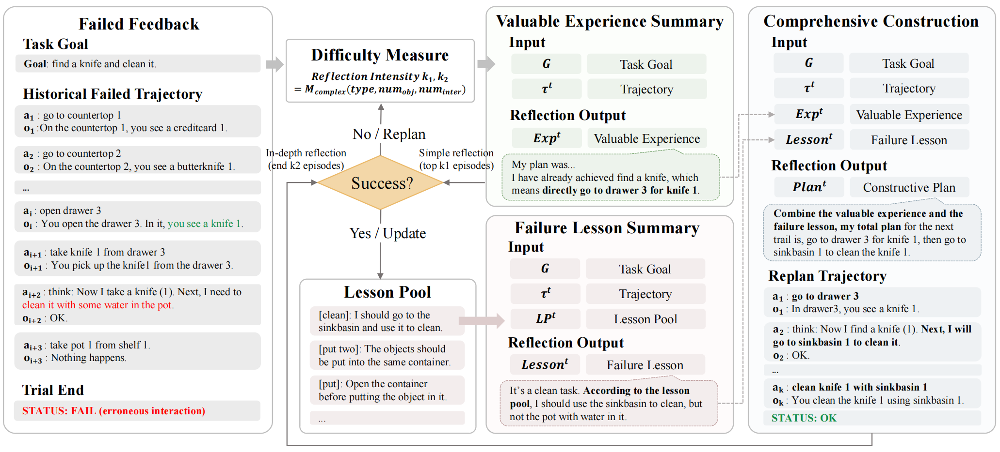

<!-- <h1 align="center"> Flexible Constructivism Reflection for Long-Horizon Robotic Task Planning with Large Language Models </h1> -->

<!--

  IROS 2025

-->

<!--
[author1](https://www.yuque.com/zhangjiatao-grdyv/rn49ht/lq7xzy4xmxgrpgz9), [author2](https://www.yuque.com/zhangjiatao-grdyv/rn49ht/vsarazgdts43o7y4)
-->

## Abstract
Autonomous error correction is critical for domestic robots to achieve reliable execution of complex long-horizon tasks. Prior work has explored self-reflection in Large Language Models (LLMs) for task planning error correction; however, existing methods are constrained by inflexible self-reflection mechanisms that limit their effectiveness. Motivated by these limitations and inspired by human cognitive adaptation, we propose the Flexible Constructivism Reflection Framework (FCRF), a novel Mentor-Actor architecture that enables LLMs to perform flexible self-reflection based on task difficulty, while constructively integrating historical valuable experience with failure lessons. We evaluated FCRF on diverse domestic tasks through simulation in AlfWorld and physical deployment in the real-world environment. Experimental results demonstrate that FCRF significantly improves overall performance and self-reflection flexibility in complex long-horizon robotic tasks. 

## Paper
<iframe  width="400" height="420" src="./FCRF_Flexible_Constructivism_Reflection_for_Long_Horizon_Robotic_Task_Planning_with_Large_Language_Models.pdf"></iframe>

## Video
<iframe width="100%" height="420" src="https://www.youtube.com/embed/wRxH_F7mPKQ?si=WXvnpf3U-jjUIryt" title="YouTube video player" frameborder="0" allow="accelerometer; autoplay; clipboard-write; encrypted-media; gyroscope; picture-in-picture; web-share" allowfullscreen></iframe>

## my_Video

  <video id="video" controls="" preload="none" poster="作者(图片地址)">
    <source id="mp4" src="./video1.mp4" type="video/mp4">
  </video>

## Results
Comparison of FCRF and baseline reflection method in an AlfWorld example:

  

## Methodology
The framework of FCRF. The planning process is executed by the Actor LLM, the reflection process is executed by the Mentor LLM. During
the self-reflection process, the difficulty level of the task is first assessed, according to which the Mentor flexibly selects reflection intensity, determine the proportion of simple experience retain and in-depth failure lessons extraction among all the reflection episodes. Combining the valuable experience and failure lesson, the Mentor performs a constructivism self-reflection to guide the next round of planning of the Actor. The reflection results and planning trajectories will be stored in the memory module for long-term management.

  

 

  

## Appendix
### A.Method
#### 1.Prompt of Task Decomposition

Listing 1: Prompt for finishing task decomposition,we only need to input the Fixed-format task goal in the dataset

    

    <pre>
Please split the task goal，and there are some examples:

      
Task Goal: on_poundcake_kitchentable(id:123): 1,on_milk_kitchentable(id:123): 1, 
#The goal means the task is "put one poundcake on kitchentable and put one milk on kitchentable" 
#so we can split the goal into 2 subgoal,follow this return format exactly. 
return subgoal[on_poundcake_kitchentable(id:123): 1], subgoal[on_milk_kitchentable(id:123): 1]

Task Goal: on_chicken_kitchentable(id:123): 2, 
#The goal means the task is "put two chickens on the kitchentable" 
#so we can split the goal into 1 subgoal,follow this return format exactly. 
return subgoal[on_chicken_kitchentable(id:123): 2]

Task Goal: closed_microwave(id:158): 1,turnon_microwave(id:158): 1,closed_stove(id:150): 1,turnon_stove(id:150):1,inside_pancake_microwave(id:158): 1,inside_cupcake_stove(id:150): 1, 
#The goal means the task is "put one pancake in microwave and switch on microwave, put one cupcake in stove and switch on stove" 
#so we can split the goal into 2 subgoal,follow this return format exactly. 
return subgoal[closed_microwave(id:158): 1,turnon_microwave(id:158): 1,inside_pancake_microwave(id:158): 1], subgoal[closed_stove(id:150): 1,turnon_stove(id:150): 1,inside_cupcake_stove(id:150): 1]

Task Goal:closed_stove(id:150): 1,turnon_stove(id:150): 1,inside_poundcake_stove(id:150):3,on_milk_kitchentable(id:123): 2, 
#The goal means the task is "put three poundcakes in stove and switch on stove, put two milk on kitchentable" 
#so we can split the goal into 2 subgoal,follow this return format exactly. 
return subgoal[closed_stove(id:150):1,turnon_stove(id:150):1 ,inside_poundcake_stove(id:150):3],subgoal[on_milk_kitchentable(id:123): 2]

Task Goal:{input} 
  </pre>
  

#### 2.Prompt of Task Planning

Listing 2: The full prompt with LLM of our agent to implement task planning

    

    <pre>

long-term memory:
      
from actions import walk (obj), grab (obj), switchon (obj), switchoff (obj), open (obj), close (obj), putin (obj) (obj), putback (obj) (obj)

#remeber if the key object INSIDE kitchencabinet, you should open the kitchencabinet first or the key object INSIDE room, you should walk to the room,and different id represent different items, so note the id number. # remeber you should grab only one item at a time and you can not open a cabinet that has been opened

#The total task goal: {task_goal}
#The completed task goal: {completed_goal}

short-term memory:

There are some examples:

{example_task1}
{example_task2}
{example_task3}

 #remember the key object locations and states: {message}
 #The task goal: {current_task_goal}
def task():
  </pre>
  

Listing 3:In the short-term memory, dynamically select three examples according to the current task goal and insert them into the prompt.Here is a set of examples to choose from.

    

    <pre>
-------------------------------------------------------------------------- 
# remember the key object locations and states: [("stove(id:150)", "INSIDE", "kitchen(id:50)"), ("chicken(id:332)", "INSIDE", "microwave(id:158)"),("chicken(id:333)", "INSIDE", "microwave(id:158)")] and stove(id:150)'s states are closed,off,microwave(id:158)'s states are closed,off, 
#The task goal: closed_stove(id:150): 1,turnon_stove(id:150): 1,inside_chicken_stove(id:150): 2, 
def task():
#The goal means the task is "put two chickens in stove and switch on stove" 
#1.Subgoal Thought: find the first chicken
#2.Rule Thought: The chicken(id:332) inside microwave(id:158),the microwave is closed,so we should open the microwave first
walk('kitchen(id:50)')
find('microwave(id:158)')
open('microwave(id:158)')
grab('chicken(id:332)')
close('microwave(id:158)')
#0.Rule Thought: You have grabbed chicken, remember you should grab only one item at a time,so put the chicken first. 
#1.Subgoal Thought: put the chicken in stove
#2.Rule Thought: put the chicken in stove（id:150）, the stove is closed, so we should open the stove first. find('stove(id:150)')
open('stove(id:150)')
putin('chicken(id:332)', 'stove(id:150)')
close('stove(id:150)')
#1.Subgoal Thought:find the second chicken
#2.Rule Thought: the second chicken(id:333) inside microwave(id:158),the microwave is closed,so we should open the
microwave first
walk('kitchen(id:50)')
find('microwave(id:158)')
open('microwave(id:158)')
grab('chicken(id:333)')
close('microwave(id:158)')
#0.Rule Thought: You have grabbed chicken,remember you should grab only one item at a time,so put the chicken first. 
#1.Subgoal Thought:put the chicken in stove
#2.Rule Thought: put the chicken in stove(id:150), the stove is closed, so we should open the stove first. open('stove(id:150)')
putin('chicken(id:333)', 'stove(id:150)')
close('stove(id:150)')
#1.Subgoal Thought:switch on the stove
#2.Rule Thought: When we switch on the stove, we should make sure it is closed. switchon('stove(id:150)')
# done
--------------------------------------------------------------------------
-------------------------------------------------------------------------- 
# remember the key object locations and states: [('pancake(id:342)', 'INSIDE', 'livingroom(id:262)')] and microwave(id:158)'s states are closed,off, #The task goal: closed_microwave(id:158): 1,turnon_microwave(id:158): 1,inside_pancake_microwave(id:158): 1
def task():
#The goal means the task is "put one pancake in microwave and switch on microwave". 
#1.Subgoal Thought: find one pancake. #2.Rule Thought: The pancake(id:342) inside livingroom(id:262),so we should walk to the livingroom first. 
walk('livingroom(id:262)')
find('pancake(id:342)')
grab('pancake(id:342)')
#0.Rule Thought: You have grabbed pancake,remember you should grab only one item at a time,so put the pancake first. 
#1.Subgoal Thought: put the pancake in microwave. #2.Rule Thought: put the pancake(id:342) in microwave(id:158), the microwave is closed, so we should open the microwave first.
find('microwave(id:158)')
open('microwave(id:158)')
putin('pancake(id:342)', 'microwave(id:158)')
close('microwave(id:158)')
#1.Subgoal Thought:switch on the microwave
#2.Rule Thought: When we switch on the microwave, we should make sure it is closed. 
switchon('microwave(id:158)')
# done
--------------------------------------------------------------------------
-------------------------------------------------------------------------- 
#remember the key object locations and states: [('cupcake(id:334)', 'INSIDE', 'kitchencabinet(id:131)'), ('cupcake(id:332)','INSIDE', 'kitchencabinet(id:130)'), ('cupcake(id:333)', 'INSIDE', 'kitchencabinet(id:126)')] and stove(id:150)'s states are closed,off,kitchencabinet(id:131)'s state is closed,kitchencabinet(id:130)'s state is closed,kitchencabinet(id:126)'s state is closed, 
#The task goal: closed_stove(id:150): 1,turnon_stove(id:150): 1,inside_cupcake_stove(id:150): 1
def task():
#The goal means the task is "put one cupcake in stove and switch on stove." 
#1.Subgoal Thought: find one cupcake. 
#2.Rule Thought: The cupcake(id:334) inside kitchencabinet(id:131),the kitchencabinet is closed,so we should open the kitchencabinet first. 
find('kitchencabinet(id:131)')
open('kitchencabinet(id:131)')
find('cupcake(id:334)')
grab('cupcake(id:334)')
close('kitchencabinet(id:131)')
#0.Rule Thought: You have grabbed cupcake,remember you should grab only one item at a time,so put the cupcake first. 
#1.Subgoal Thought: put the cupcake in stove
#2.Rule Thought: put the cupcake(id:334) in stove(id:150), and the stove is closed, so we should open the stove first. 
find('stove(id:150)')
open('stove(id:150)')
putin('cupcake(id:334)', 'stove(id:150)')
close('stove(id:150)')
#1.Subgoal Thought:switch on the stove
#2.Rule Thought: When we switch on the stove, we should make sure it is closed. 
switchon('stove(id:150)')
# done
--------------------------------------------------------------------------
-------------------------------------------------------------------------- 
# remember the key object current locations and states: [('chicken(id:332)', 'INSIDE', 'fridge(id:149)')] and fridge(id:149)'sstate is closed, 
#The task goal: on_chicken_kitchentable(id:123): 1
def task():
#The goal means the task is "put one chicken on kitchentable" 
#1.Subgoal Thought: find the chicken
#2.Rule Thought: The chicken(id:332) inside fridge(id:149), the fridge is closed,so we should open the fridge first. 
find('fridge(id:149)')
open('fridge(id:149)')
grab('chicken(id:332)')
close('fridge(id:149)')
#0.Rule Thought: You have grabbed chicken,remember you should grab only one item at a time,so put the chicken first. 
#1.Subgoal Thought: put the chicken on the kitchentable
#2.Rule Thought: put the chicken(id:332) on the kitchentable(id:123). find('kitchentable(id:123)')
putback('chicken(id:332)', 'kitchentable(id:123)')
# done
--------------------------------------------------------------------------
-------------------------------------------------------------------------- 
# remember the key object locations and states: [('milk(id:332)', 'INSIDE', 'kitchencabinet(id:128)'), ('milk(id:333)','INSIDE', 'kitchencabinet(id:130)')] and kitchencabinet(id:128)'s state is closed,kitchencabinet(id:130)'s state is closed,kitchencabinet(id:126)'s state is closed, #The task goal: on_milk_kitchentable(id:123): 2
def task():
#The goal means the task is "put two milk on kitchentable" 
#1.Subgoal Thought: find the first milk
#2.Rule Thought: The milk(id:332) inside kitchencabinet(id:128), the kitchencabinet is closed,so we should open the kitchencabinet first. 
walk('kitchen(id:50)')
find('kitchencabinet(id:128)')
open('kitchencabinet(id:128)')
find('milk(id:332)')
grab('milk(id:332)')
close('kitchencabinet(id:128)')
#0.Rule Thought: You have grabbed milk,remember you should grab only one item at a time,so put the milk first. 
#1.Subgoal Thought: put the first milk on the kitchentable
#2.Rule Thought: put the milk(id:332) on the kitchentable(id:123)
find('kitchentable(id:123)')
putback('milk(id:332)', 'kitchentable(id:123)')
#1.Subgoal Thought: find the second milk
#2.Rule Thought: The milk(id:333) inside kitchencabinet(id:130), the kitchencabinet is closed,so we should open the kitchencabinet first. find('kitchencabinet(id:130)')
open('kitchencabinet(id:130)')
find('milk(id:333)')
grab('milk(id:333)')
close('kitchencabinet(id:130)')
#0.Rule Thought: You have grabbed milk,remember you should grab only one item at a time,so put the milk first. 
#1.Subgoal Thought: put the second milk on the kitchentable
#2.Rule Thought: put the milk(id:333) on the kitchentable(id:123)
find('kitchentable(id:123)')
putback('milk(id:333)', 'kitchentable(id:123)')
# done
--------------------------------------------------------------------------
-------------------------------------------------------------------------- 
# remember the key object locations and states: [('chicken(id:333)', 'INSIDE', 'stove(id:150)'), ('chicken(id:332)', 'INSIDE','fridge(id:149)')] and stove(id:150)'s states are closed,off,fridge(id:149)'s state is closed, 
#The task goal: on_chicken_kitchentable(id:123): 2
def task():
#The goal means the task is "put two chickens on kitchentable" 
#1.Subgoal Thought: find the first chicken
#2.Rule Thought: The chicken(id:332) inside fridge(id:149),the fridge is closed, so we should open the fridge first
open('fridge(id:149)')
find('chicken(id:332)')
grab('chicken(id:332)')
close('fridge(id:149)')
#0.Rule Thought: You have grabbed chicken,remember you should grab only one item at a time,so put the chicken first. 
#1.Subgoal Thought: put the chicken on kitchentable
#2.Rule Thought: put the chicken(id:332) on kitchentable(id:123)
find('kitchentable(id:123)')
putback('chicken(id:332)', 'kitchentable(id:123)')
#1.Subgoal Thought:find the second chicken
#2.Rule Thought: The chicken(id:333) inside stove(id:150),the stove is closed, so we should open the stove first
open('stove(id:150)')
find('chicken(id:333)')
grab('chicken(id:333)')
close('stove(id:150)')
#0.Rule Thought: You have grabbed chicken,remember you should grab only one item at a time,so put the chicken first. 
#1.Subgoal Thought: put the chicken on kitchentable
#2.Rule Thought: put the chicken(id:333) on kitchentable(id:123)
find('kitchentable(id:123)')
putback('chicken(id:333)', 'kitchentable(id:123)')
# done
--------------------------------------------------------------------------
  </pre>
  

Listing 4: An example of our method, full interaction process of the task goal {on_chicken_kitchentable(id:123): 2}

    

    <pre>
------------------------------------------------input prompt-------------------------------------------------------------
long_memory:
      
from actions import walk (obj), grab (obj), switchon (obj), switchoff (obj), open (obj), close (obj), putin (obj) (obj), putback (obj) (obj)
#remeber if the key object INSIDE kitchencabinet, you should open the kitchencabinet first or the key object INSIDE room, you should walk to the roomand different id represent different items, so note the id number.remeber you should grab only one item at a time and you can not open a cabinet that has been opened
#The total task goal: on_chicken_kitchentable(id:123): 2, 
#The completed task goal:

short_memory:

There are some examples:
#remember the key object locations and states: [('chicken(id:333)', 'INSIDE', 'stove(id:150)'), ('chicken(id:332)','INSIDE', 'fridge(id:149)')] and stove(id:150)'s states are closed,of ,fridge(id:149)'s state is closed, #The task goal: on_chicken_kitchentable(id:123): 2
def task():
#The goal means the task is "put two chickens on kitchentable" 
#1.Subgoal Thought: find the first chicken
#2.Rule Thought: The chicken(id:332) inside fridge(id:149),the fridge is closed, so we should open the fridge first
open('fridge(id:149)')
find('chicken(id:332)')
grab('chicken(id:332)')
close('fridge(id:149)')
#1.Subgoal Thought: put the chicken on kitchentable
#2.Rule Thought: put the chicken(id:332) on kitchentable(id:123)
find('kitchentable(id:123)')
putback('chicken(id:332)', 'kitchentable(id:123)')
#1.Subgoal Thought:find the second chicken
#2.Rule Thought: The chicken(id:333) inside stove(id:150),the stove is closed, so we should open the stove first
open('stove(id:150)')
find('chicken(id:333)')
grab('chicken(id:333)')
close('stove(id:150)')
#1.Subgoal Thought: put the chicken on kitchentable
#2.Rule Thought: put the chicken(id:333) on kitchentable(id:123)
find('kitchentable(id:123)')
putback('chicken(id:333)', 'kitchentable(id:123)')
#done

#remember the key object current locations and states: [('chicken(id:332)', 'INSIDE', 'fridge(id:149)')] and fridge(id:149)'s state is closed, #The task goal: on_chicken_kitchentable(id:123): 1
def task():
#The goal means the task is "put one chicken on kitchentable" #1.Subgoal Thought: find the chicken
#2.Rule Thought: The chicken(id:332) inside fridge(id:149), the fridge is closed,so we should open the fridge first. find('fridge(id:149)')
open('fridge(id:149)')
grab('chicken(id:332)')
close('fridge(id:149)')
#1.Subgoal Thought: put the chicken on the kitchentable
#2.Rule Thought: put the chicken(id:332) on the kitchentable(id:123). find('kitchentable(id:123)')
putback('chicken(id:332)', 'kitchentable(id:123)')
#done

#remember the key object locations and states: [('milk(id:332)', 'INSIDE', 'kitchencabinet(id:128)'), ('milk(id:333)','INSIDE', 'kitchencabinet(id:130)')] and kitchencabinet(id:128)'s state is closed,kitchencabinet(id:130)'s state is closed,kitchencabinet(id:126)'s state is closed, 
#The task goal: on_milk_kitchentable(id:123): 2
def task():
#The goal means the task is "put two milk on kitchentable" 
#1.Subgoal Thought: find the first milk
#2.Rule Thought: The milk(id:332) inside kitchencabinet(id:128), the kitchencabinet is closed,so we should open the kitchencabinet first.
walk('kitchen(id:50)')
find('kitchencabinet(id:128)')
open('kitchencabinet(id:128)')
find('milk(id:332)')
grab('milk(id:332)')
close('kitchencabinet(id:128)')
#1.Subgoal Thought: put the first milk on the kitchentable
#2.Rule Thought: put the milk(id:332) on the kitchentable(id:123)
find('kitchentable(id:123)')
putback('milk(id:332)', 'kitchentable(id:123)')
#1.Subgoal Thought: find the second milk
#2.Rule Thought: The milk(id:333) inside kitchencabinet(id:130), the kitchencabinet is closed,so we should open the kitchencabinet first.
find('kitchencabinet(id:130)')
open('kitchencabinet(id:130)')
find('milk(id:333)')
grab('milk(id:333)')
close('kitchencabinet(id:130)')
#1.Subgoal Thought: put the second milk on the kitchentable
#2.Rule Thought: put the milk(id:333) on the kitchentable(id:123)
find('kitchentable(id:123)')
putback('milk(id:333)', 'kitchentable(id:123)')
#done

#remember the key object locations and states: [('chicken(id:332)', 'INSIDE', 'fridge(id:149)'), ('chicken(id:333)','INSIDE', 'fridge(id:149)'), ('chicken(id:334)', 'INSIDE', 'stove(id:150)')] and fridge(id:149)'s state is closed,fridge(id:149)'s state is closed,stove(id:150)'s state is closed, 
#The task goal: on_chicken_kitchentable(id:123): 2
def task(): 
-------------------------------------------------------end----------------------------------------------------------

-------------------------------------------------our agent output---------------------------------------------------- 
#The goal means the task is "put two chickens on kitchentable" 
#1.Subgoal Thought: find the first chicken
#2.Rule Thought: The chicken(id:332) inside fridge(id:149),the fridge is closed, so we should open the fridge first
open('fridge(id:149)')
find('chicken(id:332)')
grab('chicken(id:332)')
close('fridge(id:149)')
#1.Subgoal Thought: put the chicken on kitchentable
#2.Rule Thought: put the chicken(id:332) on kitchentable(id:123)
find('kitchentable(id:123)')
putback('chicken(id:332)', 'kitchentable(id:123)')
#1.Subgoal Thought:find the second chicken
#2.Rule Thought: The chicken(id:333) inside fridge(id:149),the fridge is closed, so we should open the fridge first
open('fridge(id:149)')
find('chicken(id:333)')
grab('chicken(id:333)')
close('fridge(id:149)')
#1.Subgoal Thought: put the chicken on kitchentable
#2.Rule Thought: put the chicken(id:333) on kitchentable(id:123)
find('kitchentable(id:123)')
putback('chicken(id:333)', 'kitchentable(id:123)')
#done
-------------------------------------------------------end---------------------------------------------------------
    </pre>
  

### B.Experiments
#### 1.Implement of Planning-only

We have adopted the prompt construction method from ProgPrompt but do not include interaction with the environment.The planning-only method consists of embedding {task_goal}(he current task goal) and {message}(the initial observed state of the environment) directly into the prompt, allowing the agent to generate a complete plan for the task.

Listing 5:The full prompt with LLM of planning-only agent to implement task planning

    

    <pre>
from actions import walk (obj), grab (obj), switchon (obj), switchoff (obj), open (obj), close (obj), putin (obj) (obj), putback (obj) (obj)
#remeber if the key object INSIDE kitchencabinet, you should open the kitchencabinet first or the key object INSIDE room, you should walk to the roomand different id represent different items, so note the id number.
#remeber you should grab only one item at a time and you can not open a cabinet that has been opened
      
#There are some examples:
      
#remember the key object locations and states: [["stove(id:150)", "INSIDE", "kitchen(id:50)"], ["chicken(id:332)", "INSIDE", "microwave(id:158)"]["chicken(id:333)", "INSIDE", "microwave(id:158)"]] and stove(id:150)'s states are closed,off,microwave(id:158)'s state is closed, 
#The task goal: closed_stove(id:150): 1,turnon_stove(id:150): 1,inside_chicken_stove(id:150): 2, 
def task():
#The goal means the task is "put two chickens in stove and switch on stove" 
#1.find the first chicken
walk('kitchen(id:50)')
find('microwave(id:158)')
open('microwave(id:158)')
grab('chicken(id:332)')
close('microwave(id:158)')
#2.put the chicken in stove
find('stove(id:150)')
open('stove(id:150)')
putin('chicken(id:332)', 'stove(id:150)')
close('stove(id:150)')
#3.find the second chicken
walk('kitchen(id:50)')
find('microwave(id:158)')
open('microwave(id:158)')
grab('chicken(id:333)')
close('microwave(id:158)')
#4.put the chicken in stove
open('stove(id:150)')
putin('chicken(id:333)', 'stove(id:150)')
close('stove(id:150)')
We have adopted the prompt construction method from ProgPrompt[6] but do not include interaction with the 
environment.The planning-only method consists of embedding {task_goal}(he current task goal) and {message
}(the initial observed state of the environment) directly into the prompt, allowing the agent to generate a 
complete plan for the task.
#5.switch on the stove
switchon('stove(id:150)')
#6.done

#remember the key object locations and states: [["microwave(id:158)", "INSIDE", "kitchen(id:50)"], ["stove(id:150)", "INSIDE", "kitchen(id:50)"], ["pancake(id:342)", "INSIDE", "livingroom(id:262)"], ["cupcake(id:332)", "INSIDE", "kitchencabinet(id:130)"], ["cupcake(id:333)", "INSIDE", "kitchencabinet(id:126)"], ["cupcake(id:334)", "INSIDE", "kitchencabinet(id:131)"]] and stove(id:150)'s states are closed,off,microwave(id:158)'s states are closed,off,kitchencabinet(id:130)'s state is closed,kitchencabinet(id:126)'s state is closed,kitchencabinet(id:131)'s state is closed, 
#The task goal: closed_microwave(id:158): 1,turnon_microwave(id:158): 1,closed_stove(id:150): 1,turnon_stove(id:150):1,inside_pancake_microwave(id:158): 1,inside_cupcake_stove(id:150): 1, 
def task():
#The goal means the task is "put one pancake in microwave and switch on microwave, put one cupcake in stove and switch on stove".
#1.find one pancake
walk('livingroom(id:262)')
find('pancake(id:342)')
grab('pancake(id:342)')
#2.put the pancake in microwave
find('microwave(id:158)')
open('microwave(id:158)')
putin('pancake(id:342)', 'microwave(id:158)')
close('microwave(id:158)')
#3.switch on the microwave
switchon('microwave(id:158)')
#4.find one cupcake
walk('kitchen(id:50)')
find('kitchencabinet(id:130)')
open('kitchencabinet(id:130)')
find('cupcake(id:332)')
grab('cupcake(id:332)')
close('kitchencabinet(id:130)')
#5.put the cupcake in stove
find('stove(id:150)')
open('stove(id:150)')
putin('cupcake(id:332)', 'stove(id:150)')
close('stove(id:150)')
#6.switch on the stove
switchon('stove(id:150)')
#done

#remember the key object locations and states: [["kitchentable(id:123)", "INSIDE", "kitchen(id:50)"], ["poundcake(id:332)", "INSIDE", "stove(id:150)"], ["poundcake(id:348)", "INSIDE", "cabinet(id:222)"], ["milk(id:333)","INSIDE", "kitchencabinet(id:127)"], ["milk(id:334)", "INSIDE", "kitchencabinet(id:128)"], ["milk(id:335)", "INSIDE", "kitchencabinet(id:127)"]] and stove(id:150)'s state is closed,cabinet(id:222)'s states is closed,kitchencabinet(id:127)'s state is closed,kitchencabinet(id:128)'s state is closed,
#The task goal: on_poundcake_kitchentable(id:123): 1,on_milk_kitchentable(id:123): 1, 
def task():
#The goal means the task is "put one poundcake on kitchentable and put one milk on kitchentable" 
#1.find one poundcake
walk('kitchen(id:50)')
find('stove(id:150)')
open('stove(id:150)')
find('poundcake(id:332)')
grab('poundcake(id:332)')
close('stove(id:150)')
#2.put the poundcake on the kitchentable
find('kitchentable(id:123)')
putback('poundcake(id:332)', 'kitchentable(id:123)')
#3.find one milk
find('kitchencabinet(id:127)')
open('kitchencabinet(id:127)')
find('milk(id:333)')
grab('milk(id:333)')
close('kitchencabinet(id:127)')
#4.put the milk on the kitchentable
walk('kitchen(id:50)')
putback('milk(id:333)', 'kitchentable(id:123)')
#5.done

#remember the key object locations and states: {message}
#The task goal: {task_goal}
def task():
    </pre>
  

Listing 6: An example of planning-only method, full interaction process of the task goal {on_chicken_kitchentable(id:123): 2}

    

    <pre>
------------------------------------------------input prompt-------------------------------------------------------------
from actions import walk (obj), grab (obj), switchon (obj), switchoff (obj), open (obj), close (obj), putin (obj) (obj), putback (obj) (obj)

#remeber if the key object INSIDE kitchencabinet, you should open the kitchencabinet first or the key object INSIDE room, you should walk to the room and different id represent different items, so note the id number.
#remeber you should grab only one item at a time and you can not open a cabinet that has been opened

#There are some examples:

#remember the key object locations and states: [["stove(id:150)", "INSIDE", "kitchen(id:50)"], ["chicken(id:332)","INSIDE", "microwave(id:158)"]["chicken(id:333)", "INSIDE", "microwave(id:158)"]] and stove(id:150)'s states are closed,off,microwave(id:158)'s state is closed, 
#The task goal: closed_stove(id:150): 1,turnon_stove(id:150): 1,inside_chicken_stove(id:150): 2, 
def task():
#The goal means the task is "put two chickens in stove and switch on stove" 
#1.find the first chicken
walk('kitchen(id:50)')
find('microwave(id:158)')
open('microwave(id:158)')
grab('chicken(id:332)')
close('microwave(id:158)')
#2.put the chicken in stove
find('stove(id:150)')
open('stove(id:150)')
putin('chicken(id:332)', 'stove(id:150)')
close('stove(id:150)')
#3.find the second chicken
walk('kitchen(id:50)')
find('microwave(id:158)')
open('microwave(id:158)')
grab('chicken(id:333)')
close('microwave(id:158)')
#4.put the chicken in stove
open('stove(id:150)')
putin('chicken(id:333)', 'stove(id:150)')
close('stove(id:150)')
#5.switch on the stove
switchon('stove(id:150)')
#6.done

#remember the key object locations and states: [["microwave(id:158)", "INSIDE", "kitchen(id:50)"], ["stove(id:150)", "INSIDE", "kitchen(id:50)"], ["pancake(id:342)", "INSIDE", "livingroom(id:262)"], ["cupcake(id:332)", "INSIDE", "kitchencabinet(id:130)"], ["cupcake(id:333)", "INSIDE", "kitchencabinet(id:126)"], ["cupcake(id:334)", "INSIDE", "kitchencabinet(id:131)"]] and stove(id:150)'s states are closed,off,microwave(id:158)'s states are closed,off,kitchencabinet(id:130)'s state is closed,kitchencabinet(id:126)'s state is closed,kitchencabinet(id:131)'s state is closed, 
#The task goal: closed_microwave(id:158): 1,turnon_microwave(id:158): 1,closed_stove(id:150): 1,turnon_stove(id:150): 1,inside_pancake_microwave(id:158): 1,inside_cupcake_stove(id:150): 1, 
def task():
#The goal means the task is "put one pancake in microwave and switch on microwave, put one cupcake in stove and switch on stove". 
#1.find one pancake
walk('livingroom(id:262)')
find('pancake(id:342)')
grab('pancake(id:342)')
#2.put the pancake in microwave
find('microwave(id:158)')
open('microwave(id:158)')
putin('pancake(id:342)', 'microwave(id:158)')
close('microwave(id:158)')
#3.switch on the microwave
switchon('microwave(id:158)')
#4.find one cupcake
walk('kitchen(id:50)')
find('kitchencabinet(id:130)')
open('kitchencabinet(id:130)')
find('cupcake(id:332)')
grab('cupcake(id:332)')
close('kitchencabinet(id:130)')
#5.put the cupcake in stove
find('stove(id:150)')
open('stove(id:150)')
putin('cupcake(id:332)', 'stove(id:150)')
close('stove(id:150)')
#6.switch on the stove
switchon('stove(id:150)')
#done

#remember the key object locations and states: [["kitchentable(id:123)", "INSIDE", "kitchen(id:50)"], ["poundcake(id:332)", "INSIDE", "stove(id:150)"], ["poundcake(id:348)", "INSIDE", "cabinet(id:222)"], ["milk(id:333)", "INSIDE", "kitchencabinet(id:127)"], ["milk(id:334)", "INSIDE", "kitchencabinet(id:128)"], ["milk(id:335)", "INSIDE", "kitchencabinet(id:127)"]] and stove(id:150)'s state is closed,cabinet(id:222)'s states is closed,kitchencabinet(id:127)'s state is closed,kitchencabinet(id:128)'s state is closed, 
#The task goal: on_poundcake_kitchentable(id:123): 1,on_milk_kitchentable(id:123): 1, 
def task():
#The goal means the task is "put one poundcake on kitchentable and put one milk on kitchentable" 
#1.find one poundcake
walk('kitchen(id:50)')
find('stove(id:150)')
open('stove(id:150)')
find('poundcake(id:332)')
grab('poundcake(id:332)')
close('stove(id:150)')
#2.put the poundcake on the kitchentable
find('kitchentable(id:123)')
putback('poundcake(id:332)', 'kitchentable(id:123)')
#3.find one milk
find('kitchencabinet(id:127)')
open('kitchencabinet(id:127)')
find('milk(id:333)')
grab('milk(id:333)')
close('kitchencabinet(id:127)')
#4.put the milk on the kitchentable
walk('kitchen(id:50)')
putback('milk(id:333)', 'kitchentable(id:123)')
#5.done

#remember the key object locations and states: [('chicken(id:333)', 'INSIDE', 'fridge(id:149)'), ('chicken(id:334)','INSIDE', 'stove(id:150)'), ('chicken(id:332)', 'INSIDE', 'fridge(id:149)')] and fridge(id:149)'s state is closed,stove(id:150)'s state is closed, 
#The task goal: on_chicken_kitchentable(id:123): 2, 
def task():
-------------------------------------------------------end----------------------------------------------------------

--------------------------------------------planning-only agent output-------------------------------------------------- 
#The goal means the task is "put two chickens on kitchentable" 
#1.find the first chicken in fridge
walk('kitchen(id:50)')
find('fridge(id:149)')
open('fridge(id:149)')
find('chicken(id:333)')
grab('chicken(id:333)')
close('fridge(id:149)')
#2.put the first chicken on the kitchentable
find('kitchentable(id:123)')
putback('chicken(id:333)', 'kitchentable(id:123)')
#3.find the second chicken in fridge
find('fridge(id:149)')
open('fridge(id:149)')
find('chicken(id:332)')
grab('chicken(id:332)')
close('fridge(id:149)')
#4.put the second chicken on the kitchentable
find('kitchentable(id:123)')
putback('chicken(id:332)', 'kitchentable(id:123)')
#5.done   
    </pre>
  

#### 2.Implement of Planning-Reasoning
In tackling complex task planning, various prior works have explored LLMs playing different roles to complete tasks .Each role takes on distinct responsibilities, thereby alleviating the reasoning burden associated with complex tasks.Our planning-reasoning method delegates the entire task planning process to different roles assumed by LLM. Two agents, acting as the planner and reasoner respectively, collaborate in this method. The reasoner is responsible for comprehending the overall task objective and instructs the planner on the execution steps required. The planner, on the other hand, focuses on action planning for individual execution steps.Like other methods, each planner will accept input of the current initial environment information.

Listing 7: Full prompt for reasoner, the only input is {task_goal}

    

    <pre>
Now you are a task planning assistant, responsible for inferring the execution steps of a task.You should mimic the provided examples and, based on the task objectives,understand the total task goal first, generate the next sub-task. 
There are some examples:
      
Task goal: on_poundcake_kitchentable(id:123): 1,on_milk_kitchentable(id:123): 1, 
#The goal means "put one poundcake on kitchentable and put one milk on kitchentable" 
Reasoning task lists:
#1.put one poundcake on the kitchentable(id:123)
#2.put one milk on the kitchentable(id:123)

Task goal: closed_dishwasher(id:152): 1,turnon_dishwasher(id:152): 1,inside_chicken_dishwasher(id:152): 2, 
#The goal means the task is "put two chickens in dishwasher and switch on dishwasher" 
Reasoning task lists:
#1.put two chickens in dishwasher and switch on dishwasher(id:152)

Task goal: closed_microwave(id:158): 1,turnon_microwave(id:158): 1,closed_stove(id:150): 1,turnon_stove(id:150): 1,inside_pancake_microwave(id:158): 1,inside_cupcake_stove(id:150): 1, 
#The goal means the task is "put one pancake in microwave and switch on microwave, put one cupcake in stove and switch on stove". 
Reasoning task lists:
#1.put one pancake in microwave(id:158) and switch on microwave(id:158)
#2.put one cupcake in stove(id:150) and switch on stove(id:150)

Task Goal:closed_stove(id:150): 1,turnon_stove(id:150): 1,inside_poundcake_stove(id:150): 3,on_milk_kitchentable(id:123): 2,
#The goal means the task is "put three poundcakes in stove and switch on stove, put two milk on kitchentable" 
Reasoning task lists:
#1.put three poundcakes in stove(id:150) and switch on stove(id:150)
#2.put two milk on kitchentable(id:123)

Imitate these examples to generate a step-by-step plan. 
Task goal: {task_goal}
Reason task lists:
    </pre>
  

Listing 8: Full prompt for planner.

    

    <pre>
Now you are a task planning assistant. You should mimic the examples I provide and generate a sequence of actions based on the target instructions and environmental information.Pay attention to the task objectives and environmental information.And remember if the key object INSIDE kitchencabinet, you should open the kitchencabinet first,or the key object INSIDE room, you should walk to the room,and different id represent different items, so note the id number.Remember you should grab only one item at a time and you can not open a cabinet that has been opened. 

There are some examples:

Now the task is: # put two chickens in stove and switch on stove
#remember the key object locations and states: [["stove(id:150)", "INSIDE", "kitchen(id:50)"], ["chicken(id:332)", "INSIDE", "microwave(id:158)"]["chicken(id:333)", "INSIDE", "microwave(id:158)"]] and stove(id:150)'s states are closed,off,microwave(id:158)'s state is closed, 
Planning action lists:
#1.find the first chicken
walk('kitchen(id:50)')
find('microwave(id:158)')
open('microwave(id:158)')
grab('chicken(id:332)')
close('microwave(id:158)')
#2.put the chicken in stove
find('stove(id:150)')
open('stove(id:150)')
putin('chicken(id:332)', 'stove(id:150)')
close('stove(id:150)')
#3.find the second chicken
walk('kitchen(id:50)')
find('microwave(id:158)')
open('microwave(id:158)')
grab('chicken(id:333)')
close('microwave(id:158)')
#4.put the chicken in stove
open('stove(id:150)')
putin('chicken(id:333)', 'stove(id:150)')
close('stove(id:150)')
#5.switch on the stove
switchon('stove(id:150)')
#6.done

Now the task is: # put one poundcake on kitchentable
#remember the key object locations and states: [["kitchentable(id:123)", "INSIDE", "kitchen(id:50)"], ["poundcake(id:332)", "INSIDE", "stove(id:150)"], ["poundcake(id:348)", "INSIDE", "cabinet(id:222)"], ["milk(id:333)","INSIDE", "kitchencabinet(id:127)"], ["milk(id:334)", "INSIDE", "kitchencabinet(id:128)"], ["milk(id:335)", "INSIDE", "kitchencabinet(id:127)"]] and stove(id:150)'s state is closed,cabinet(id:222)'s states is closed,kitchencabinet(id:127)'s state is closed,kitchencabinet(id:128)'s state is closed, 
Planning action lists:
#1.find one poundcake
walk('kitchen(id:50)')
find('stove(id:150)')
open('stove(id:150)')
find('poundcake(id:332)')
grab('poundcake(id:332)')
close('stove(id:150)')
#2.put the poundcake on the kitchentable
find('kitchentable(id:123)')
putback('poundcake(id:332)', 'kitchentable(id:123)')

Now the task is: # put two milk on kitchentable
#remember the key object locations and states: [('milk(id:332)', 'INSIDE', 'kitchencabinet(id:128)'), ('milk(id:333)','INSIDE', 'kitchencabinet(id:130)')] and kitchencabinet(id:128)'s state is closed,kitchencabinet(id:130)'s state is closed,kitchencabinet(id:126)'s state is closed, 
Planning action lists:
#1.find the first milk
walk('kitchen(id:50)')
find('kitchencabinet(id:128)')
open('kitchencabinet(id:128)')
find('milk(id:332)')
grab('milk(id:332)')
close('kitchencabinet(id:128)')
#2.put the first milk on the kitchentable
find('kitchentable(id:123)')
putback('milk(id:332)', 'kitchentable(id:123)')
#3.find the second milk
find('kitchencabinet(id:130)')
open('kitchencabinet(id:130)')
find('milk(id:333)')
grab('milk(id:333)')
close('kitchencabinet(id:130)')
#4.put the second milk on the kitchentable
find('kitchentable(id:123)')
putback('milk(id:333)', 'kitchentable(id:123)')

Now the task is: # switch/turn on microwave
#remember the key object locations and states: [["milk(id:335)", "INSIDE", "kitchencabinet(id:127)"]] and microwave(id:158)'s state is closed,kitchencabinet(id:127)'s state is closed, 
Planning action lists:
#1.switch on the microwave
switchon('microwave(id:158)')

Imitate these examples to generate an action list. 
Now the task is: {reasoner_output}
#remember the key object locations and states:{message}
Planning action lists:
    </pre>
  

Listing 9: Full interaction process of the task goal {closed_microwave(id:158): 1,turnon_microwave(id:158): 1,on_milk_kitchentable(id:123): 3,inside_pancake_microwave(id:158): 1}

    

    <pre>
Task goal: closed_microwave(id:158): 1,turnon_microwave(id:158): 1,on_milk_kitchentable(id:123): 3,inside_pancake_microwave(id:158): 1, 
      
Reasoner: 
Now the task is: # 1. Put one pancake in microwave (id: 158) and switch on microwave (id: 158)
Scene message: # remember the key object locations and states: [('milk(id:332)', 'INSIDE', 'kitchencabinet(id:129)'), ('milk(id:333)', 'INSIDE', 'kitchencabinet(id:128)'), ('milk(id:335)', 'INSIDE', 'bedroom(id:185)'), ('pancake(id:334)','INSIDE', 'kitchencabinet(id:132)')] and microwave(id:158)'s states are closed,off,kitchencabinet(id:129)'s state is closed,kitchencabinet(id:128)'s state is closed,kitchencabinet(id:132)'s state is closed, 
      
Planner:
#1. Find one pancake
walk('kitchen(id:50)')
find('kitchencabinet(id:132)')
open('kitchencabinet(id:132)')
find('pancake(id:334)')
grab('pancake(id:334)')
close('kitchencabinet(id:132)')
#2. Put the pancake in the microwave
find('microwave(id:158)')
open('microwave(id:158)')
putin('pancake(id:334)', 'microwave(id:158)')
close('microwave(id:158)')
#3. Switch on the microwave
switchon('microwave(id:158)')

Reasoner: 
Now the task is: # 2. Put three milk on kitchentable (id: 123)
Scene message: # remember the key object locations and states: [('milk(id:332)', 'INSIDE', 'kitchencabinet(id:129)'), ('milk(id:333)', 'INSIDE', 'kitchencabinet(id:128)'), ('milk(id:335)', 'INSIDE', 'bedroom(id:185)')] and microwave(id:158)'s states are closed,on,kitchencabinet(id:129)'s state is closed,kitchencabinet(id:128)'s state is closed, 

Planner:
#find the first milk
walk('kitchen(id:50)')
find('kitchencabinet(id:129)')
open('kitchencabinet(id:129)')
find('milk(id:332)')
grab('milk(id:332)')
close('kitchencabinet(id:129)')
#put the first milk on the kitchentable
find('kitchentable(id:123)')
putback('milk(id:332)', 'kitchentable(id:123)')
#find the second milk
find('kitchencabinet(id:128)')
open('kitchencabinet(id:128)')
find('milk(id:333)')
grab('milk(id:333)')
close('kitchencabinet(id:128)')
#put the second milk on the kitchentable
find('kitchentable(id:123)')
putback('milk(id:333)', 'kitchentable(id:123)')
#find the third milk
walk('kitchen(id:50)')
find('bedroom(id:185)')
find('milk(id:335)')
grab('milk(id:335)')
#put the third milk on the kitchentable
find('kitchentable(id:123)')
putback('milk(id:335)', 'kitchentable(id:123)')  
    </pre>
  

